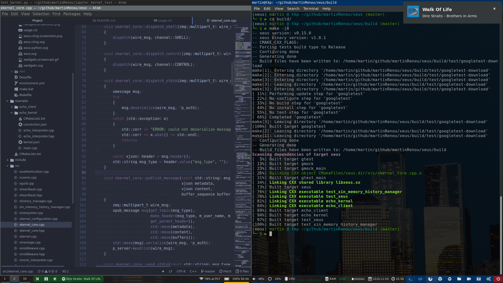

# dotfiles

Setup:
- Ubuntu 18
- `i3` with https://github.com/csxr/i3-gnome
- `polybar` and dependencies https://github.com/jaagr/polybar/wiki/Compiling
- `peek` for screen recording
- `compton` for window transparency (needed by `peek`)
- `feh` for the background image
- `FontAwesome` for polybar logos

# 
